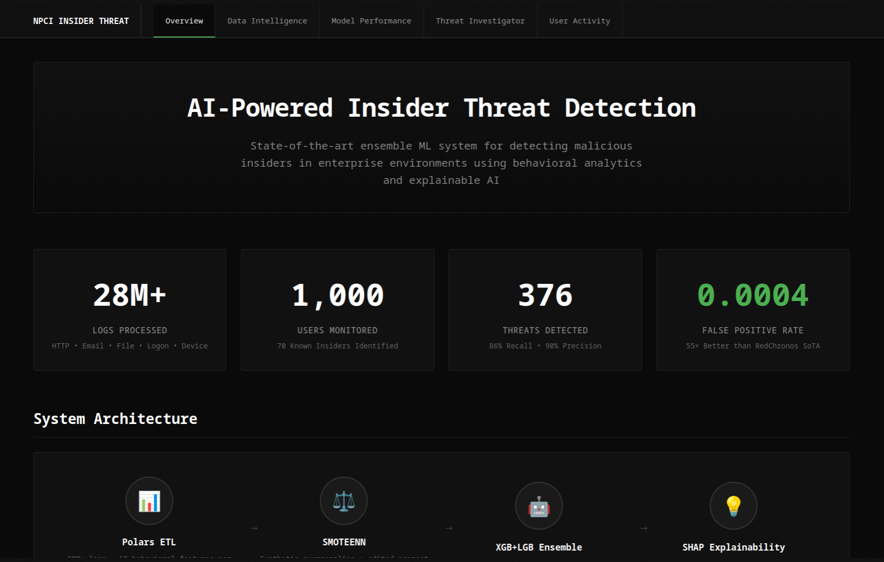
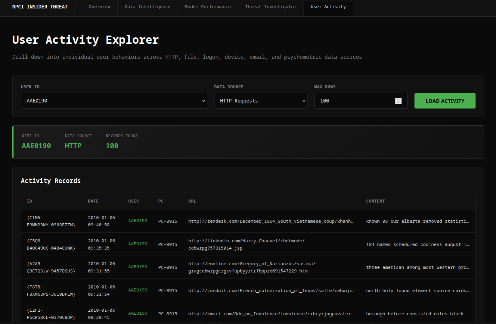

# NPCI Insider Threat Intelligence Platform

Production-grade insider threat detection and investigation platform built on CERT r4.2 behavioral telemetry, with a high-precision XGBoost + LightGBM ensemble and explainable AI workflows.




## Why This Project Matters

Most insider-threat systems optimize for recall and flood SOC teams with false positives. This project is designed for **operational trust**:

- **Ultra-low false positives:** Ensemble FPR of **0.0004** (0.04%)
- **High-quality detection:** F1 of **88.0%**, AUC of **99.2%**
- **Enterprise explainability:** SHAP attribution + natural-language incident narratives (Gemini)
- **Analyst-first UX:** Full risk timeline, top incidents, and per-user evidence drilldown

Compared with published SoTA RedChronos numbers, this system achieves roughly **55x lower FPR** (0.0004 vs 0.022), a key requirement for real SOC deployment.

---

## Model Architecture

The core detector is a weighted ensemble:

```text
Risk Score = 0.55 * P(XGBoost) + 0.45 * P(LightGBM)
```

### Complete System Architecture Diagram

```mermaid
flowchart TD
    A[CERT r4.2 Data Sources\nfile/http/logon/device/email\npsychometric/LDAP] --> B[Data Ingestion Layer\nCSV streaming/chunked reads]
    B --> C[User-Day Aggregation\nper user per day behavioral vectors]
    C --> D[Feature Engineering Layer]

    D --> D1[Volume Features\nfile_count/http_count/logon_count]
    D --> D2[Behavioral Ratio Features\nfile_del_ratio/http_sus_ratio/email_ext_ratio]
    D --> D3[Temporal Features\nafter-hours/weekend/day_of_week/month]
    D --> D4[Rolling Baselines\n7d mean/std per user]
    D --> D5[User-Centric Z-Score Features\n(feature - user_mean)/(user_std + eps)]

    D1 --> E[Model Input Matrix\n62 engineered features]
    D2 --> E
    D3 --> E
    D4 --> E
    D5 --> E

    E --> F1[XGBoost Classifier]
    E --> F2[LightGBM Classifier]

    F1 --> G[Weighted Ensembler\n0.55 XGB + 0.45 LGB]
    F2 --> G
    G --> H[Risk Score 0-1]
    H --> I{Thresholding/Ranking}

    I --> J[Top Incident Detection]
    J --> K1[SHAP Attribution\nfeature-level impact]
    K1 --> K2[Gemini Explanation\nSOC-friendly narrative]

    I --> L[Threat Investigator UI\nTimeline + Incidents]
    K2 --> L
    H --> M[API Layer\n/api/score /api/investigate-user]
    M --> L
```

### Training highlights

- **Dataset:** CERT r4.2 user activity logs (multi-source behavioral telemetry)
- **Class imbalance:** ~241:1 (normal:insider)
- **Balancing:** SMOTEENN
- **Samples:** ~230K original -> ~275K after balancing
- **Feature strategy:** User-day behavioral profiling with user-centric normalization

### Stored model artifacts

- `models/xgboost.pkl`
- `models/lightgbm.pkl`

Both models are production-loaded by the FastAPI backend and used for real-time scoring.

---

## Feature Pipeline

The live pipeline aggregates user activity into daily behavioral vectors and computes risk signals from multiple sources.

### End-to-end extraction flow

1. **Ingest multi-source logs** into memory-safe chunks.
2. **Normalize entities** (user IDs, timestamps, missing values).
3. **Aggregate to user-day level** to represent each user as a daily behavior profile.
4. **Engineer behavior features**: counts, suspicious actions, contextual ratios, temporal signals.
5. **Compute rolling baseline features** per user (7-day mean/std) to model personal normal behavior.
6. **Compute z-score anomaly features** relative to each user baseline.
7. **Assemble final feature vector** for ensemble scoring.

### Current online feature builder

Implemented in `src/webui/features.py`:

- File activity aggregates (count, copy, delete, unique files)
- HTTP behavior aggregates (count, suspicious URL patterns, unique URLs)
- Derived ratios (`delete_ratio`, `suspicious_ratio`, etc.)
- Time context (`day_of_week`, `month`, `is_weekend`)
- Rolling user baselines (7-day mean/std, z-score style features)

### Why z-score features are critical

Insider threats are highly personalized: a behavior that is normal for one role can be anomalous for another. Absolute thresholds alone miss this nuance.

For each user and feature, we compute:

```text
z = (current_value - user_mean) / (user_std + epsilon)
```

This gives three major benefits:

- **Personalized anomaly detection:** detects deviation from *that user's* own baseline.
- **Scale invariance:** makes features comparable across users with very different activity volumes.
- **Better signal for tree ensembles:** improves split quality on rare insider patterns under heavy class imbalance.

In short, z-score features convert raw activity into behavioral surprise, which is exactly what insider detection needs.

### Why XGBoost + LightGBM ensemble

- **XGBoost** is robust on sparse/noisy tabular behavior data and captures non-linear interactions well.
- **LightGBM** is highly efficient and often finds complementary splits on high-cardinality behavior features.
- **Weighted fusion (0.55/0.45)** reduces model-specific blind spots and improves calibrated risk ranking.
- **Operational outcome:** stronger precision-recall tradeoff with very low FPR for SOC workflows.

### Important note

The notebook (`main.ipynb`) represents the authoritative training logic and references broader sources (logon/device/email/psychometric/LDAP). The web feature builder currently implements a reduced online subset and fills missing fields with defaults to maintain inference compatibility.

---

## Explainable AI Stack

- **SHAP** provides top feature attributions for high-risk incidents
- **Gemini** generates analyst-readable explanations and recommended actions
- **Threat Investigator UI** links timeline peaks -> incident evidence -> explanation

---

## Web Platform

FastAPI backend + vanilla JavaScript frontend (no heavy frontend framework), with five operational pages:

1. Overview
2. Data Intelligence
3. Model Performance
4. Threat Investigator
5. User Activity Explorer

### Main API endpoints

- `GET /api/model-metrics`
- `GET /api/roc-curve`
- `GET /api/pr-curve`
- `GET /api/users`
- `POST /api/user-activity`
- `POST /api/user-timeline`
- `GET /api/investigate-user/{user_id}`
- `GET /api/explain-incident/{user_id}/{date}`
- `POST /api/score`

---

## Project Structure

```text
npci-insider-threat-final/
├── main.ipynb
├── notebooks/
│   └── main.ipynb
├── models/
│   ├── xgboost.pkl
│   └── lightgbm.pkl
├── src/
│   ├── server.py
│   ├── templates/
│   └── webui/
├── requirements.txt
├── .gitignore
└── LICENSE
```

---

## Setup

## 1) Create and activate virtual environment

```bash
python -m venv .venv
source .venv/bin/activate
```

## 2) Install dependencies

```bash
pip install -r requirements.txt
```

## 3) Configure environment

Set your Gemini key (optional, but required for AI explanations):

```bash
export GOOGLE_API_KEY="your_google_api_key"
```

## 4) Ensure dataset is present

Expected dataset root:

```text
r4.2/
  file.csv
  http.csv
  logon.csv
  device.csv
  email.csv
  psychometric.csv
  LDAP/
```

## 5) Run the application

```bash
uvicorn src.server:app --reload --host 0.0.0.0 --port 8000
```

Open: `http://localhost:8000`

---

## Reproducibility and Validation

- Primary notebook: `main.ipynb`
- Production server: `src/server.py`
- Model analytics: `src/webui/analytics.py`
- Feature builder: `src/webui/features.py`

Use notebook outputs as the authoritative reference for training/evaluation claims.

---

## Tech Stack

- Python, FastAPI, Uvicorn
- XGBoost, LightGBM, scikit-learn
- SHAP
- Google Gemini API
- Plotly, Vanilla JS

---

## License

See `LICENSE`.
